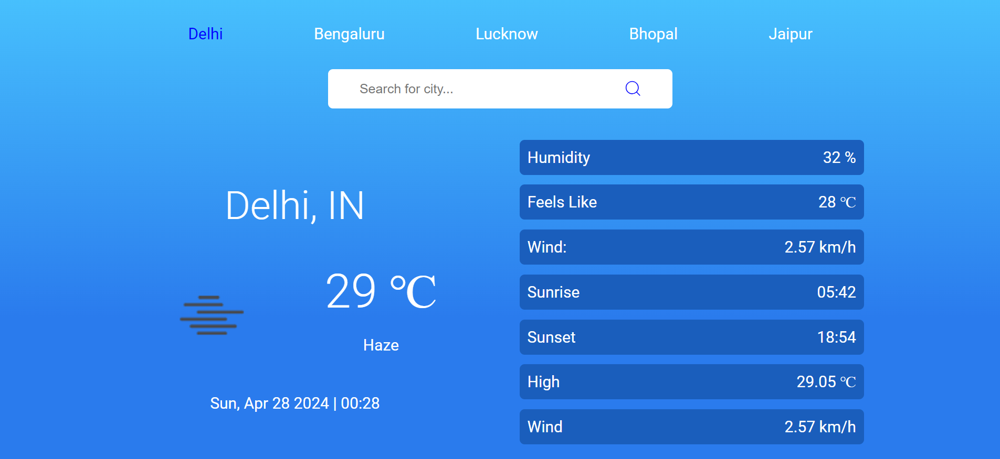
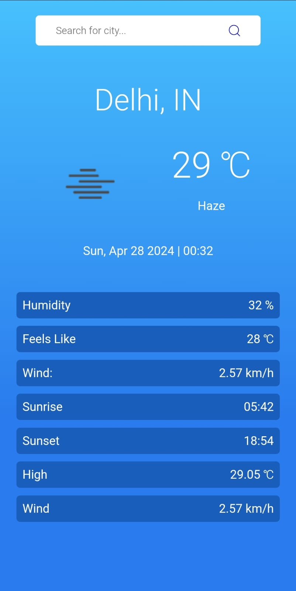

# Weather App

This is a simple weather application built using React. It allows users to search for a city by name and view its current weather information, including temperature, humidity, wind speed, and weather conditions.

## Important Links

- [Deployed Link](https://frontend-digitalpani.vercel.app/)

- [Repo Link](https://github.com/artisonii/frontend_Digitalpani)

## Features

- **Search by City:** Users can enter the name of the city they want to search for in the search bar.
- **Current Weather:** The app displays the current weather information for the searched city, including temperature, humidity, wind speed, and weather conditions.
- **Responsive Design:** The application is responsive and works well on both desktop and mobile devices.

## How to use

1. Clone the repository to your local machine.
2. Install dependencies by running `npm install`.
3. Start the development server by running `npm run dev`.
4. Open the application in your browser and start searching for cities to get their weather information.

## Technologies Used

- React.js
- CSS
  -JavaScript
- OpenWeatherMap API

## Screenshots

- For Large Screen

- For Small Screen

# Created by Arti Soni

- [LinkedIn](https://www.linkedin.com/in/arti-soni/)
- [Portfolio](https://artisonii.github.io/)
- [GitHub](https://github.com/artisonii)
